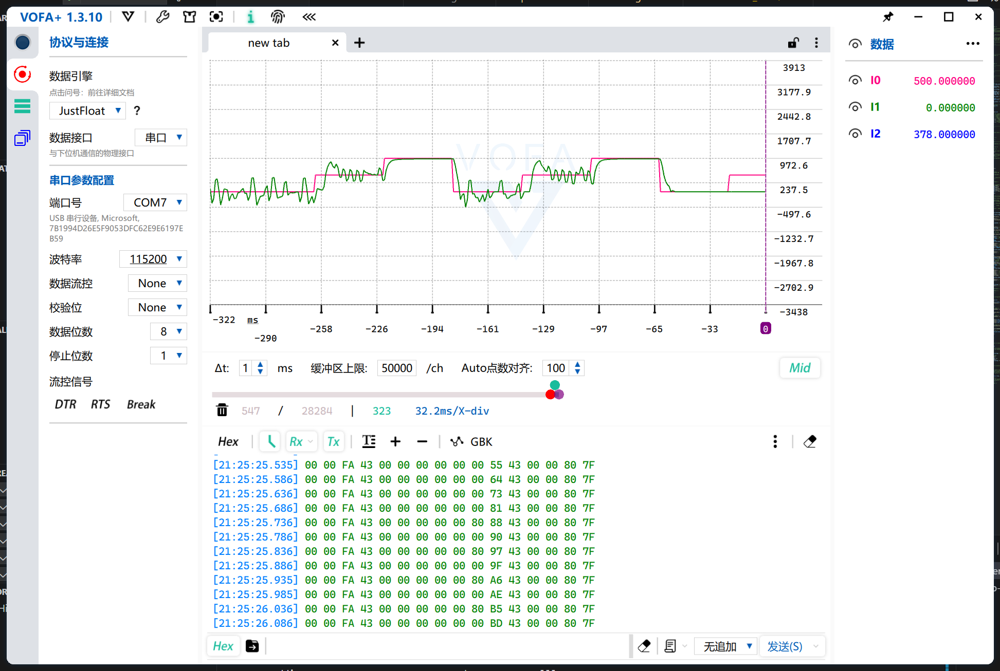
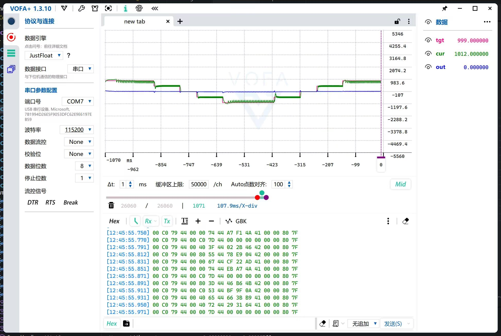

# 底层踩坑血泪史

## 一、幻想成为I2C高手

### 背景：  
  - 跟随**江协科技**视频学习 **STM32F103C8T6** 的硬件 **I2C** 。
### 现象：
   - 主循环内固定调用硬件 **I2C** 驱动 **OLED** 时，直接用**硬件复位**/**软件复位**单片机，概率出现 ***I2C 总线死锁***现象。
### 理性分析：
   - 在互联网检索相关信息，发现众多网友皆经历过此类问题，结论是 **STM32F103** 系列单片机**硬件 I2C** 存在设计缺陷，总线通信过程复位易导致从机持续拉低 **SDA** 线，致使通信锁死。
### 试图解决：
   - 查阅资料发现，部分网友提出启动时先将 **I2C 相关的 GPIO** 初始化为**推挽输出**，然后施以几个**时钟脉冲**以模拟***结束信号***，有可能可以恢复锁死的总线。
### 结局：
   - 总线死锁问题仍旧存在。
### 总结：
   - 简单的小实验项目还是用***软件 I2C*** 吧。
     > 单片机是这样的， **ST** 公司只要好好设计芯片就好了，而**开发者**要考虑的就多了。

## 二、你这PWM味不正啊

### 背景：
   - 机器人比赛，尝试使用 **PID** 算法闭环控制电机，以期满足**麦克纳姆轮**对电机转速的控制要求。
   - 经权衡，选择使用 **TB6612** 作为电机控制模块。
   - 购买时没有注意，错买成 **AT8236** ，但是代码逻辑仍旧为 **TB6612** 的逻辑。
   - **AT8236** 并无 **PWM** 引脚，需要在 **IN1** 和 **IN2** 上输入 **PWM** 信号以控制电机。
   - 接线时，只接了 ***IN1*** 和 ***IN2*** 引脚，根本没有接 ***PWM*** 引脚
### 现象：
   - 电机转速抖动**极其**剧烈， **PID** 参数完全无法整定
   - 设置速度低于 **50%** 最大速度时，电机转速抖动**无法控制**   
      
     > 为什么我的 **PID** 跟教程的差别这么大？
### 炼化头发：
   - 尝试引入**低通滤波**、**输出死区**，将本已重构完毕的***定点 PID*** 再次更改为***浮点 PID*** 。
   - 发现设置**低占空比**无法完成起转，引入**启动脉冲**。
   - 最终整定的 ***PID*** 参数， **Kp** 数量级为 $10^{-1}$ ； **Ki** 数量级为 $10^{-2}$ ； **Kd** 数量级为 $10^{-3}$ 。
      
     > ***哈哈哈哈哈***我终于搞定了我真强
### 情况真是急转直下啊：
   - 装车，*接线*时突然忘记*调试*时是怎么接的了。
     > **PWM** 引脚在哪？我明明完成了正反转和转速的闭环控制啊？我***穿越***了？？？
### 胡乱观察：
   - ***PID*** 控制的**输出量**极低。
     > 难道电机**平衡阻力**不用多少占空比？
   - 电机**转速**稳定后，再次达到**目标值**时会**马上回落**，然后再升高顶到**目标值**，如此循环。
     > **积分项**你演我？
### 破案：
   - 根据程序中的**控制逻辑**  
   `if (g_motor_out._1 > 0)`  
        `{`  
            `LL_GPIO_SetOutputPin(Motor1_Con1_GPIO_Port, Motor1_Con1_Pin);`  
            `LL_GPIO_ResetOutputPin(Motor1_Con2_GPIO_Port, Motor1_Con2_Pin);`   
        `}`  
        `else if (g_motor_out._1 < 0)`  
        `{`  
            `LL_GPIO_ResetOutputPin(Motor1_Con1_GPIO_Port, Motor1_Con1_Pin);`  
            `LL_GPIO_SetOutputPin(Motor1_Con2_GPIO_Port, Motor1_Con2_Pin);`  
        `}`  
        `else`  
        `{`  
            `LL_GPIO_SetOutputPin(Motor1_Con1_GPIO_Port, Motor1_Con1_Pin);`  
            `LL_GPIO_SetOutputPin(Motor1_Con2_GPIO_Port, Motor1_Con2_Pin);`  
        `}`  
   判断是 ***PID*** 输出的正负值，导致 ***IN1*** 和 ***IN2*** 引脚不断跳变，阴差阳错实现了 **PWM** 生成。但是 **PID** 调控周期为 **20ms** ,因此 **“PWM”** 频率仅有 **50Hz**。
   - 这也就解释了上面的现象   
     1. **电机转速抖动严重**： ***50 Hz*** 的 **“PWM”** 频率太低，电机的机械时间常数无法跟上 ***50 Hz*** 的快速切换，导致*剧烈振荡*。
     2. **低占空比无法起转**：当 **PID** 输出绝对值较小时，脉冲时间间隔**太长**，无法克服电机静摩擦。
     3. **转速达到目标后出现“回落-升高”循环**：转速**第一次**达到目标转速时，先维持一段时间**消除积分累积**，然后由于输出的*浮点数*较小，转化为*定点数*时被截断，导致 **PID** 输出为 ***0*** ，电机由于**制动/摩擦**减速，然后再次因为 **PID** 调控升高，如此循环。
     > 喜欢玩开关？
### 话又说回来了：
   - 既然破案了，那我接上 **真·PWM** ，用 **18 kHz** 爽推，总该**岁月静好**了吧？
   - 真正的 ***PID*** 调控，**减速**超调反而比上述情况下的 ***神秘 PWM*** 还严重。
     > 我没招了。
### 倒反天罡的控制逻辑：
   - **Ki** 项较小时，积分项极容易被**截断**，累积程度非常小（这也是**低占空比**无法起转的原因）。
   - 电机**制动/滑行**减速下来后，输出迅速被 **PID** 调控恢复。
     > 它没那个能力你知道吧。
   - 换句话说：之前不是参数好，是控制系统**菜到一定程度**，反而显得**超调小**。
### 总结：
   - 少质疑**自己**（算法），多诋毁**别人**（接线）。
     > 其实**算法**和**接线**都是我做的，***嘻嘻***。
